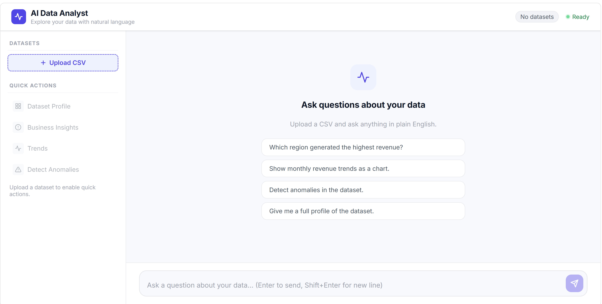
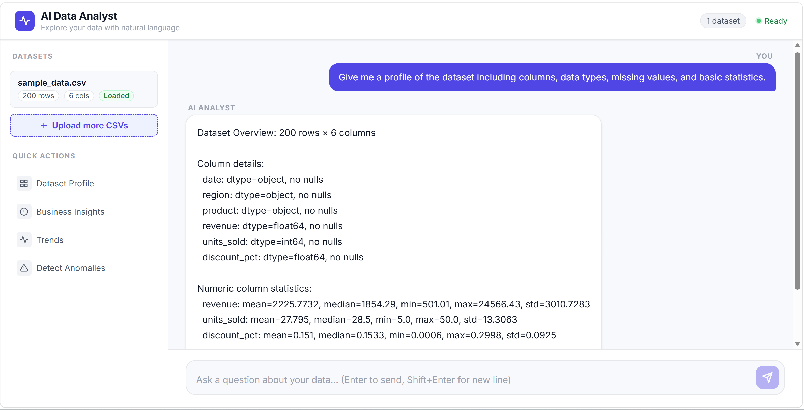
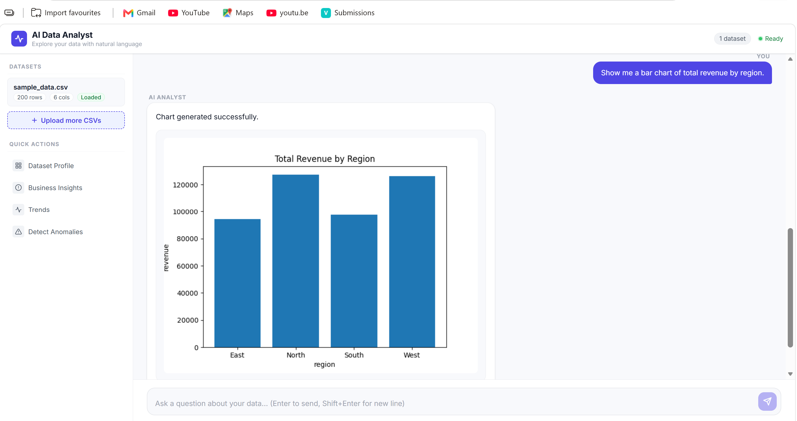
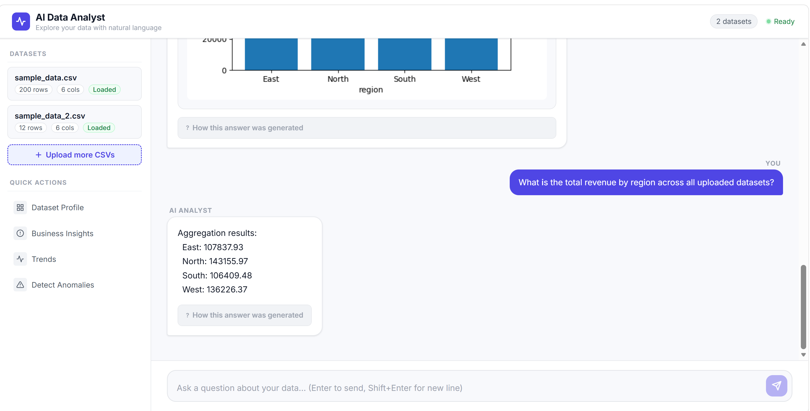
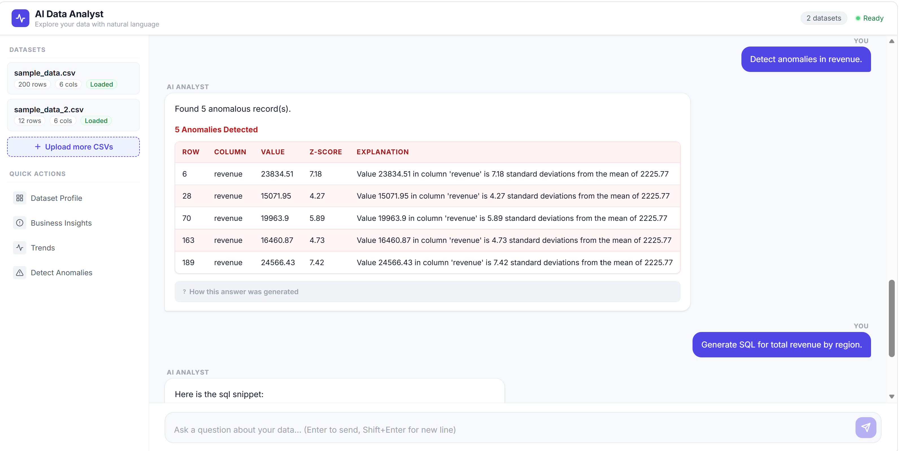

# AI Data Analyst

An AI-powered web application that lets users upload CSV datasets and ask questions in plain English. The backend uses OpenAI-compatible tool-calling to route natural-language queries to deterministic Python analysis tools, so all numerical results come from Pandas/NumPy rather than the language model. The frontend is a clean React dashboard with a sidebar, chat interface, chart rendering, and a collapsible reasoning trace per response.

---

## Demo

[Watch Demo Video](https://drive.google.com/file/d/1cjO_DmBWrg_xUGmtYQOSYj76AKMzERgf/view?usp=sharing)


---

## Screenshots

| Dashboard | Dataset Profile |
|---|---|
|  |  |

| Business Insights | Multi-File Analysis |
|---|---|
|  |  |

| Anomaly Detection |  |
|---|---|
|  | |


---

## Key Features

### Core Features

| Feature | Description |
|---|---|
| CSV upload | Drag-and-drop or click to browse; multiple files supported; client and server-side validation |
| Natural-language queries | Ask questions in plain English; the LLM selects the appropriate analysis tool |
| Dataset profiling | Row count, column count, dtypes, null counts, and descriptive statistics |
| Business insights | Deterministic summary including top group, trend direction, and value distribution |
| Data aggregation | Group-by + sum / mean / count / min / max on any column combination |
| Bar, line, pie, scatter, histogram charts | Matplotlib-rendered PNG returned as base64; displayed inline |
| Anomaly detection | Z-score and IQR methods; each flagged row includes an explanation |
| SQL code generation | Parameterised SQL snippets for aggregate, filter, and select operations |
| Pandas code generation | Equivalent Python/Pandas snippets for the same operations |
| Row filtering / querying | Filter and select rows by column conditions with configurable row limit |
| Percentage of total | Per-group share of a numeric column total; optionally highlights a specific group |
| Conversation context | Session history (up to 20 exchanges) retained per session for follow-up questions |
| Reasoning trace | Collapsible "How this answer was generated" section showing tools used and computation description |
| Multi-file analysis | `combine_all_datasets=True` concatenates all uploaded files on shared columns |
| Loading and error states | Animated thinking indicator; per-error user-friendly messages; global 500 handler |

### Bonus Features Implemented

| Feature | Details |
|---|---|
| **Multi-file analysis** | Users can ask questions across all uploaded CSVs simultaneously. The backend concatenates datasets on their shared column intersection and raises a clear error when schemas are incompatible. |
| **Tool calling / function calling** | The LLM never performs calculations directly. It selects from nine registered tools via OpenAI function-calling; each tool executes deterministically in Python. |
| **Observability / structured logging** | All requests and errors are logged with Python's `logging` module at appropriate levels. Unhandled exceptions produce a UUID error reference that links the user-facing message to the server log. |
| **OpenAI-compatible provider flexibility** | `LLM_BASE_URL` and `LLM_MODEL` environment variables allow swapping the LLM backend (Groq, Gemini, or any OpenAI-compatible endpoint) without code changes. |

### Not Implemented (future extensions)

Dashboard generation, forecasting, semantic search, caching, authentication, export/reporting, streaming responses, evaluation framework.

---

## How It Works

```
User (browser)
  │
  │  1. Upload CSV via multipart POST
  ▼
React Frontend (Vite + TypeScript)
  │
  │  2. POST /sessions/{id}/query  { "query": "..." }
  ▼
FastAPI Backend
  │
  ├── SanitisationMiddleware  — blocks path traversal and null bytes
  │
  ├── Analyst.analyse()
  │     ├── build_schema_context()   — schema summary only, no raw rows sent to LLM
  │     ├── call_llm()               — GPT-4o (or compatible model) with tool schemas
  │     └── dispatch()               — routes each tool_call to a registered tool
  │
  └── Tool Registry
        ├── dataset_profile     →  Pandas .describe() + column metadata
        ├── query_data          →  Pandas boolean filter + column select
        ├── aggregate_data      →  Pandas groupby + agg
        ├── generate_summary    →  deterministic insight templates
        ├── generate_chart      →  Matplotlib → base64 PNG
        ├── detect_anomalies    →  Z-score / IQR via NumPy
        ├── generate_sql        →  parameterised SQL string templates
        ├── generate_pandas     →  parameterised Pandas code templates
        └── percentage_of_total →  per-group share calculation

  3. QueryResponse assembled (answer + chart + code + anomaly report + reasoning trace)
  4. Frontend renders result in chat bubble
```

The LLM is used exclusively for intent understanding and tool selection. Every number in a response is computed by a Python function, not generated by the model.

---

## Architecture

Full architecture diagram and component descriptions: [`docs/architecture.md`](docs/architecture.md)

```
Browser (React)  ──►  FastAPI  ──►  Analyst  ──►  Tool Registry  ──►  Pandas / Matplotlib
                                         └──►  LLM Client  ──►  OpenAI GPT-4o
```

### Component map

| Component | File | Responsibility |
|---|---|---|
| Validator | `app/validator.py` | CSV parsing, size limit, header validation |
| Type Inferrer | `app/type_inferrer.py` | Classify columns as numeric / datetime / categorical |
| Session Store | `app/session_store.py` | In-memory UUID-keyed session state, history cap at 20 |
| Sanitisation Middleware | `app/middleware.py` | Blocks `../`, `..\`, `\x00` in path, query, and JSON body |
| Context Builder | `app/context_builder.py` | Schema-only system prompt (no raw data rows) |
| LLM Client | `app/llm_client.py` | OpenAI-compatible wrapper with configurable model and base URL |
| Tool Registry | `app/tools/registry.py` | Tool registration, `_resolve_dataframe`, `dispatch` |
| Analyst | `app/analyst.py` | Full query pipeline orchestration |
| Renderer | `app/renderer.py` | Matplotlib chart → base64 PNG |
| Anomaly Detector | `app/anomaly_detector.py` | Z-score / IQR outlier detection |
| Code Generator | `app/code_generator.py` | SQL + Pandas snippet templates + sqlglot validation |

---

## Tooling / Analysis Layer

All tools are registered in `app/tools/registry.py`. The LLM receives their JSON schemas and selects the appropriate tool(s) per query.

| Tool | What it does |
|---|---|
| `dataset_profile` | Returns row count, column count, per-column dtype/null count, and descriptive statistics for numeric columns |
| `query_data` | Filters rows by one or more column conditions (`==`, `!=`, `>`, `<`, `>=`, `<=`) and returns selected columns up to a configurable limit |
| `aggregate_data` | Groups a dataset by a categorical column and aggregates a numeric column using sum, mean, count, min, or max |
| `generate_summary` | Produces a structured textual summary including a full profile plus top-group, trend, and distribution insights |
| `generate_chart` | Renders a bar, line, pie, scatter, or histogram chart using Matplotlib and returns a base64-encoded PNG |
| `detect_anomalies` | Flags outliers using the Z-score method (default threshold 3.0) or IQR method; each flagged row includes a plain-language explanation |
| `generate_sql` | Generates a parameterised SQL snippet for aggregate, filter, or select operations; validated with sqlglot |
| `generate_pandas` | Generates the equivalent Pandas Python code snippet |
| `percentage_of_total` | Calculates each group's share of a numeric column total; optionally highlights a specific group value |

All tools support an optional `combine_all_datasets` boolean parameter. When set to `true`, the backend concatenates all uploaded DataFrames on their shared column intersection before analysis.

---

## Tech Stack

| Layer | Technology |
|---|---|
| Frontend | React 18 + TypeScript + Vite 5 |
| Styling | Plain CSS with CSS custom properties (no UI framework) |
| Backend | Python 3.11 + FastAPI 0.111 + Uvicorn |
| Data processing | Pandas 2.2 + NumPy 1.26 |
| Visualisation | Matplotlib 3.9 + Seaborn 0.13 (server-side → base64 PNG) |
| LLM integration | OpenAI Python SDK 1.30 (tool-calling / function-calling) |
| Default LLM | GPT-4o (configurable via `LLM_MODEL` + `LLM_BASE_URL`) |
| SQL validation | sqlglot 23.12 |
| Testing | Pytest 8.2 + pytest-asyncio + Hypothesis 6.102 (property-based) |
| Containerisation | Docker (multi-stage build: Node 20 + Python 3.11-slim) |
| Configuration | pydantic-settings 2.2 |

---

## Project Structure

```
ai-data-analyst/
├── app/
│   ├── main.py               # FastAPI app, exception handlers, SPA serving
│   ├── analyst.py            # Query pipeline orchestrator
│   ├── config.py             # Environment variable settings (pydantic-settings)
│   ├── context_builder.py    # Schema-only LLM system prompt
│   ├── llm_client.py         # OpenAI-compatible LLM wrapper
│   ├── middleware.py         # Input sanitisation (path traversal / null bytes)
│   ├── models.py             # All Pydantic request/response models
│   ├── session_store.py      # In-memory UUID-keyed session store
│   ├── validator.py          # CSV upload validation
│   ├── type_inferrer.py      # Column dtype classification
│   ├── renderer.py           # Matplotlib → base64 PNG
│   ├── anomaly_detector.py   # Z-score / IQR outlier detection
│   ├── code_generator.py     # SQL + Pandas code snippet generation
│   ├── exceptions.py         # Custom exception types
│   └── tools/
│       ├── registry.py       # Tool registry, _resolve_dataframe, dispatch
│       ├── aggregate_data.py
│       ├── dataset_profile.py
│       ├── detect_anomalies.py
│       ├── generate_chart.py
│       ├── generate_pandas.py
│       ├── generate_sql.py
│       ├── generate_summary.py
│       ├── percentage_of_total.py
│       └── query_data.py
├── frontend/
│   ├── src/
│   │   ├── App.tsx            # Dashboard shell (header + sidebar + chat)
│   │   ├── App.css            # CSS design system (custom properties)
│   │   └── components/
│   │       ├── Sidebar.tsx    # Dataset cards, upload, quick actions
│   │       ├── ChatPanel.tsx  # Chat interface with empty state
│   │       ├── ResponseRenderer.tsx  # Chart, code, anomaly table, trace
│   │       └── ResponseRenderer.css
│   ├── index.html
│   ├── package.json
│   └── vite.config.ts
├── tests/
│   ├── unit/                 # 25 unit test files (736 tests total)
│   ├── integration/          # API-level integration tests
│   ├── properties/           # Hypothesis property-based tests
│   └── fixtures/
│       ├── sample_data.csv   # 200 rows: date, region, product, revenue, units_sold, discount_pct
│       └── sample_data_2.csv # Second dataset for multi-file analysis tests
├── docs/
│   └── architecture.md       # Detailed architecture diagram and component map
├── Dockerfile                # Multi-stage build (Node 20 + Python 3.11-slim)
├── requirements.txt
├── pyproject.toml
└── .env.example
```

---

## Getting Started

### Prerequisites

- Python >= 3.11
- Node.js >= 20 (for local frontend development)
- npm
- Docker (for containerised deployment)
- An API key for an OpenAI-compatible LLM provider

### Environment variables

Copy `.env.example` to `.env` and fill in the values:

```bash
cp .env.example .env
```

| Variable | Required | Default | Description |
|---|---|---|---|
| `OPENAI_API_KEY` | **Yes** | — | API key for the LLM provider (OpenAI, Groq, Gemini, or compatible) |
| `LLM_MODEL` | No | `gpt-4o` | Model name, e.g. `gpt-4o`, `llama-3.3-70b-versatile`, `gemini-2.0-flash` |
| `LLM_BASE_URL` | No | _(OpenAI default)_ | Override to use a non-OpenAI endpoint, e.g. `https://api.groq.com/openai/v1` |
| `APP_ENV` | No | `development` | Environment label: `development`, `production`, or `test` |
| `MAX_UPLOAD_SIZE_MB` | No | `50` | Maximum CSV file size in megabytes |
| `MAX_HISTORY_EXCHANGES` | No | `20` | Conversation turns retained per session |

**Safe example `.env`:**

```env
OPENAI_API_KEY=your_api_key_here
LLM_MODEL=gpt-4o
LLM_BASE_URL=
APP_ENV=development
MAX_UPLOAD_SIZE_MB=50
MAX_HISTORY_EXCHANGES=20
```

Never commit your actual `.env` file to version control.

---

## Running with Docker (recommended)

The Dockerfile is a multi-stage build: Stage 1 compiles the React frontend with Node 20; Stage 2 runs the Python backend on Python 3.11-slim and serves the compiled frontend as static files.

```bash
# Build the image
docker build -t ai-data-analyst .

# Run (single command starts the full application on port 8000)
docker run -p 8000:8000 -e OPENAI_API_KEY=your_api_key_here ai-data-analyst

# Optional: pass additional environment variables
docker run -p 8000:8000 \
  -e OPENAI_API_KEY=your_api_key_here \
  -e LLM_MODEL=gpt-4o \
  ai-data-analyst
```

Open `http://localhost:8000` in your browser.

---

## Running Locally (development)

### Backend

```bash
# Python 3.11+ required
python -m venv .venv
source .venv/bin/activate        # Windows: .venv\Scripts\activate

pip install -r requirements.txt

cp .env.example .env
# Edit .env and set OPENAI_API_KEY

uvicorn app.main:app --reload --port 8000
```

### Frontend

```bash
cd frontend
npm install
npm run dev      # Vite dev server on http://localhost:5173
```

The Vite dev server proxies all `/api/*` requests to `http://localhost:8000` automatically (configured in `vite.config.ts`).

---

## Usage

### Basic workflow

1. Open the application in your browser.
2. Upload one or more CSV files using the sidebar (drag-and-drop or click to browse).
3. Type a question in the chat input and press Enter.
4. The AI selects the appropriate analysis tool, computes the result deterministically, and returns a response.
5. Charts appear inline below the text answer.
6. Generated SQL or Pandas code appears in a syntax-highlighted code block.
7. Anomaly detection results appear in a table with per-row explanations.
8. Click "How this answer was generated" to inspect the reasoning trace.
9. Ask follow-up questions — the session retains conversation history.

### Example questions

These work with the included sample dataset (`tests/fixtures/sample_data.csv`):

```
What is the total revenue by region?
Show me a bar chart of total revenue by region.
What are the key business insights from this data?
Detect anomalies in the revenue data.
Generate SQL to calculate total revenue by region.
Generate Pandas code to filter rows where discount_pct is greater than 0.3.
What percentage of total revenue came from the North region?
What is the monthly revenue trend? Show as a line chart.
Give me a full profile of the dataset.
What is the total revenue by region across all uploaded datasets?
```

The last example requires two CSV files to be uploaded and demonstrates multi-file analysis.

---

## Deterministic Analysis and Reliability

A key design principle of this application is that **the LLM does not perform numerical calculations**.

When a user asks "What is the total revenue by region?", the LLM identifies the intent and selects the `aggregate_data` tool with the appropriate parameters (`group_by="region"`, `agg_col="revenue"`, `agg_fn="sum"`). The actual computation is delegated to Pandas:

```python
df.groupby("region")["revenue"].sum()
```

This means:
- Results are **reproducible** — running the same query twice always produces the same answer.
- Results are **accurate** — there is no risk of the model hallucinating numbers.
- The LLM's role is limited to **intent understanding and tool parameter extraction**.

Generated SQL and Pandas code snippets are produced for transparency and developer utility. They are **not automatically executed** against the user's environment — execution would require explicit user action.

---

## Security and Error Handling

| Property | Implementation |
|---|---|
| No code execution | LLM output is never passed to `eval()`, `exec()`, or `subprocess`. All tool calls go through the pre-registered `dispatch()` function. |
| No raw data to LLM | Only schema summaries (column names, dtypes, null counts) are included in the system prompt. No data rows are ever sent to the external API. |
| API key safety | Loaded exclusively from environment variables via pydantic-settings; never logged or returned in any response. |
| Path traversal protection | `SanitisationMiddleware` inspects URL path, query parameters, and JSON body; blocks `../`, `..\`, and URL-encoded variants with HTTP 422. |
| Null-byte injection | Same middleware blocks `\x00` in all user-supplied inputs. |
| CSV validation | Upload validator checks file size (≤ 50 MB), parsability, minimum column/row counts, empty headers, and duplicate column names before storage. |
| Session isolation | Each session is UUID-keyed; no cross-session data access is possible. |
| Global exception handler | Any unhandled exception returns HTTP 500 with a UUID error reference. The full traceback is logged server-side; no internal details are exposed to the caller. |
| Unknown tool handling | `dispatch()` raises `UnknownToolError` if the LLM returns a tool name not in the registry; this is caught and returned as an error result rather than causing a crash. |
| Conversation history cap | Session history is capped at 20 exchanges to prevent unbounded memory growth. |

---

## Testing

```bash
# Full test suite (unit + integration + property-based)
pytest tests/ -v

# Unit tests only
pytest tests/unit/ -q

# Property-based tests only
pytest tests/properties/ -q

# Integration tests only
pytest tests/integration/ -q

# Specific test file
pytest tests/unit/test_multi_file_analysis.py -v
```

**736 tests** across three test categories. All LLM interactions are mocked — no real API calls are made during testing.

| Category | Coverage |
|---|---|
| Unit tests (25 files) | Individual tools, validator, type inferrer, session store, middleware, analyst pipeline, LLM client, renderer, anomaly detector, code generator, registry dispatch |
| Integration tests | Full API endpoint tests via HTTPX test client: file upload, query, session lifecycle |
| Property-based tests | Hypothesis-driven tests verifying correctness properties hold across arbitrary inputs (e.g. aggregation totals are consistent, profile statistics are accurate) |
| Multi-file tests | `test_multi_file_analysis.py` — 21 tests covering `_resolve_dataframe`, `dispatch` with `combine_all_datasets`, schema compatibility validation |
| LLM routing tests | `test_routing_descriptions.py` — verifies tool schema descriptions contain the correct routing phrases for the LLM |

---

## Bonus Features Status

| Bonus Feature | Status |
|---|---|
| Multi-file analysis | **Implemented** — `combine_all_datasets` parameter on all applicable tools; schema compatibility validation; 21 dedicated tests |
| Tool calling / function calling | **Implemented** — all analysis delegated to nine registered tools via OpenAI function-calling |
| Observability / logging | **Implemented** — structured logging throughout; UUID error references for unhandled exceptions |
| LLM provider flexibility | **Implemented** — `LLM_BASE_URL` + `LLM_MODEL` env vars support Groq, Gemini, or any OpenAI-compatible backend |
| Data quality checks | **Partial** — CSV validator checks structure, size, headers, and duplicates; no in-depth statistical data quality report |
| Agentic workflows | **Partial** — the analyst orchestrates multi-step tool-call sequences and includes a deterministic summary fallback when the LLM returns no tool call |
| Dashboard generation | Not implemented (future) |
| Forecasting | Not implemented (future) |
| Semantic search | Not implemented (future) |
| Caching | Not implemented (future) |
| Authentication | Not implemented (future) |
| Export / report generation | Not implemented (future) |
| Streaming responses | Not implemented (future) |
| Evaluation framework | Not implemented (future) |

---

## Assumptions and Design Decisions

| Decision | Rationale |
|---|---|
| In-memory session storage | Eliminates database dependency; suitable for single-instance demonstration scope. A production deployment would replace this with Redis or a persistent store. |
| LLM used for tool selection only | Keeps numerical results deterministic and reproducible; avoids hallucinated figures. |
| Schema-only context | Column names, dtypes, and null counts are sufficient for the LLM to select the right tool; sending raw rows would increase cost, latency, and privacy risk. |
| Multi-file combination on shared columns | Concatenating on the intersection of column names is the safest default — it avoids silent NaN columns when schemas partially overlap. |
| Generated code is not executed | SQL and Pandas snippets are for transparency and developer reference; auto-execution would require sandboxing infrastructure outside this project's scope. |
| Matplotlib server-side rendering | Avoids shipping a charting library to the browser and keeps the frontend dependency footprint small. |
| No authentication | Single-session demo scope; each page load creates a new isolated session. |
| CSV size limit: 50 MB | Balances usability with in-memory safety; configurable via `MAX_UPLOAD_SIZE_MB`. |
| History cap: 20 exchanges | Prevents unbounded memory growth per session while retaining enough context for realistic follow-up conversations. |

---

## Future Improvements

- **Persistent sessions** — replace the in-memory store with Redis or a database for multi-instance deployments.
- **Dashboard generation** — automatically produce a summary dashboard on CSV upload.
- **Forecasting** — time-series trend analysis and simple projection tools.
- **Semantic search** — vector-based search over uploaded data rows.
- **Response caching** — cache repeated identical queries within a session.
- **Authentication** — user accounts and private session history.
- **Report export** — export analysis results as PDF or Excel.
- **Streaming responses** — stream the LLM reasoning step-by-step for better perceived responsiveness.
- **Evaluation framework** — automated scoring of LLM tool-selection accuracy against a golden dataset.
- **Cloud deployment** — Kubernetes / ECS manifests for production hosting.

---

